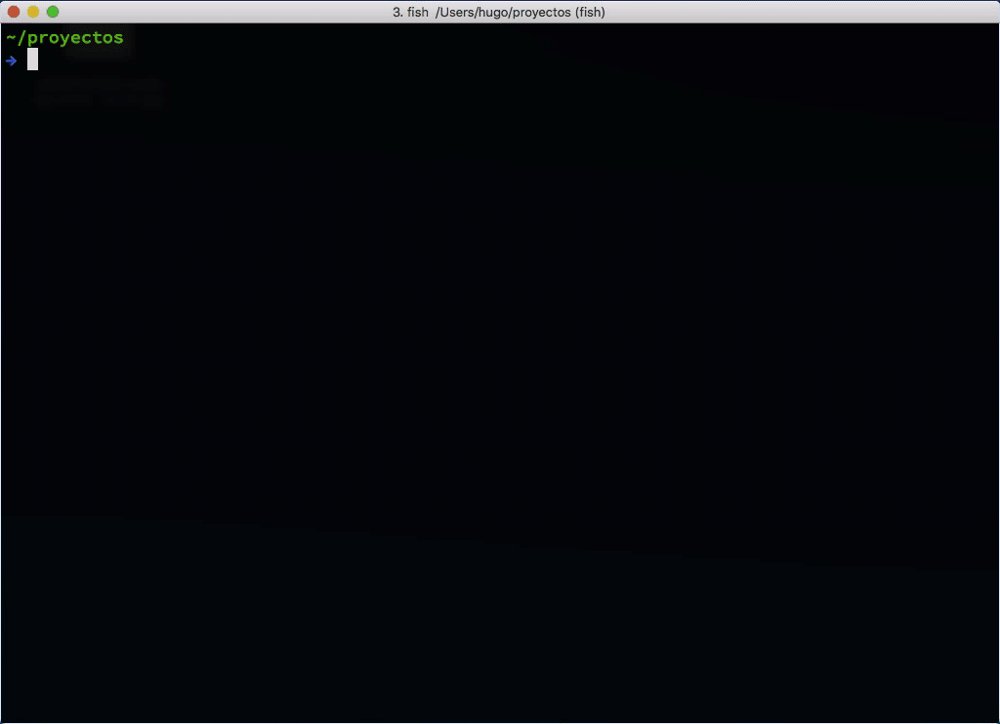

# mgit - Git Múltiple

Esta es una herramienta muy sencilla para consultar el estado de tus
copias locales de repositorios.

El comando `mgit` listará todos los repositorio en el directorio actual
junto con algunos indicadores para resolver estas consultas:

- ¿El repositorio está actualizado?.
- ¿Cuantos cambios remotos debería traer?
- ¿Hay archivos modificados que aún no se incluyeron en commits?
- ¿Cuantos commits se hicieron desde el último tag?



## Instalación

```
git clone https://github.com/hugoruscitti/mgit ~/.mgit
cd ~/.mgit
make iniciar
```

Luego, para hacer accesible el comando en tu shell:

En fish:

```
set -x PATH ~/.mgit/bin $PATH
```

En bash:

```
export PATH=$PATH:~/.mgit/bin
```

Y por último, ejecutá este comando en el directorio en donde hallas clonado
tus repositorios:

```
mgit
```

También vas a poder filtrar por el nombre del repositorio, por ejemplo:

```
mgit pilas-engine
```

Produce la salida:

```
Repositorio           Remoto    Local    Branch    Último tag
--------------------  --------  -------  --------  -------------
pilas-engine          ✓ remoto  ✓ local  master    v2.0.58 - 2 ↺
pilas-engine-backend  ✓ remoto  ✓ local  master    v0.0.6 ✓
sitio-web-de-pila...  ✓ remoto  ✓ local  master    -
```

